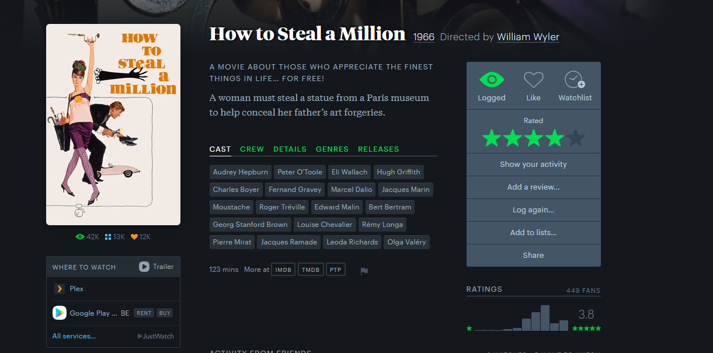

# AddPlexLinkToLetterboxd
A userscript that adds a link to a movie on letterboxd.com based on the Title and year, to your plex instance.

You have to provide the script with your 
- plex token
  -  Find your plex token [here](https://support.plex.tv/articles/204059436-finding-an-authentication-token-x-plex-token/)
- Plex server IP (without port)
- Plex Server ID (the xxxx in this kind of url: https://app.plex.tv/desktop/#!/server/xxxxxxxxxxxxxxxxx/details?key=%2Flibrary%2Fmetadata%2F33502&context=home%3Ahub.continueWatching~0~0 )
- Library section -> https://app.plex.tv/desktop/#!/media/xxxxxxxxxxxxxxx/com.plexapp.plugins.library?source=1   the last number in this url, you get when clicking on the library that contains your movies.

